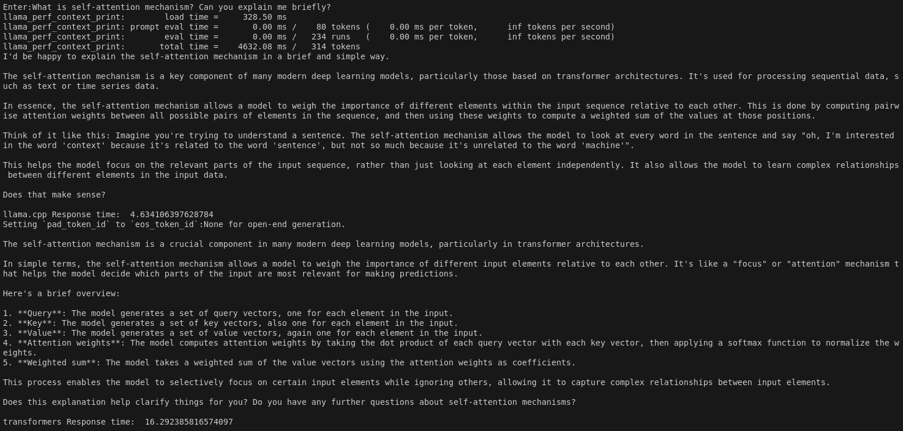

# Accelerating-LLM-Inference-with-llama-cpp-python-and-.gguf-Files-for-Optimized-Performance
This project demonstrates the performance gains achieved by using ```llama-cpp-python``` with ```.gguf``` files compared to ```.safetensors``` with the ```Transformers``` library for LLM inference. The use of ```llama-cpp-python``` significantly decreases inference time, optimizing the speed of large language model completions in a local setting.


## 🚀 Project Overview
This project explores optimizing LLM (Large Language Model) inference time by leveraging ```llama-cpp-python``` with ```.gguf``` files and comparing its performance to ```.safetensors``` used with the ```Transformers``` library. The main focus is to demonstrate how using ```llama-cpp-python``` achieves faster LLM responses, thereby enhancing real-time text generation efficiency.

**Key technologies used:**

**LLM Engine:** ```llama-cpp-python``` with Meta Llama 3.1 8B Instruct model

**Comparison Model:** Meta Llama 3.1 8B Instruct model with ```Transformers``` library

**File Formats:** ```.gguf``` and ```.safetensors``` for storing models


## 🌟 Features
**Enhanced Inference Speed:** The project uses ```llama-cpp-python``` with ```.gguf``` files, showcasing significant inference time reductions compared to ```Transformers``` with ```.safetensors```.

**Flexible Model Compatibility:** Works with Meta Llama 3.1 models, enabling efficient text generation for a wide range of applications.

**Local Execution:** Both model setups are tested locally for optimal performance comparison, focusing on a practical, user-friendly environment.


## 🛠️ Setup
Ensure you have the Llama 3.1 8B Instruct model in ```.gguf``` and ```.safetensors``` formats downloaded locally.


## 📈 Advantages
**Faster Response Time:** ```llama-cpp-python``` with ```.gguf``` reduces LLM response times significantly compared to the ```Transformers``` approach using ```.safetensors```.

**Optimized for Local Inference:** No need for complex cloud setups, providing a practical approach to speed optimization.

**Comparative Analysis Ready:** Easily benchmark and compare the performance differences between the two setups.


## 📖 How It Works
The project utilizes the Llama model with ```llama-cpp-python``` for efficient inference, leveraging optimized computation.

- Instantiate and configure ```llama-cpp-python``` and ```Transformers``` library
- Measure response time for ```llama-cpp-python``` Inference  
- Measure response time for ```Transformers``` Inference  

## 📊 Examples
Running the Comparison Script:

Execute the script to compare inference times and observe performance differences in real-time.

    python llama_cpp_vs_transformer.py  

Below is an example of how inference times are different if we compare them in them same GPU set and same prompt.



## 🤖 Future Improvements
**Additional Model Support:** Expand to different LLMs and compare their performance across various file formats.

**Quantization Strategies:** Integrate quantization methods to explore further speedups without significant accuracy loss.

**Custom Metrics:** Implement detailed performance metrics beyond response time, such as memory usage and throughput.


## 💡 Technical Considerations
**Model Size and VRAM Requirements:** Ensure sufficient VRAM for loading large models to avoid memory bottlenecks.

**File Format Handling:** The ```.gguf``` format provides optimized inference when combined with ```llama-cpp-python```, but model preparation may require different tools compared to ```.safetensors```.

**Compatibility Testing:** Confirm compatibility across different GPU architectures for best results.


